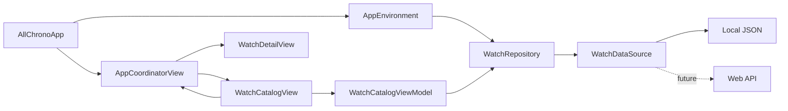
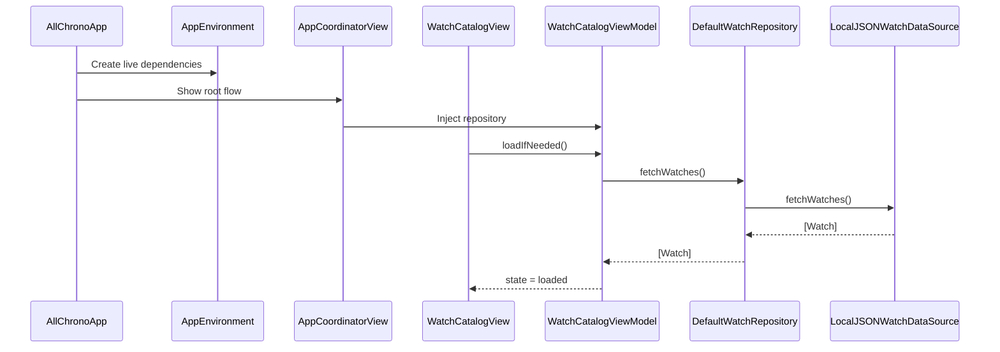

# AllChrono Architecture and App Flow

This guide explains how the AllChrono demo is organized, how data moves through the app, and where to make common future changes.

## Architecture at a glance

The app uses **MVVM-C** with a repository and data-source boundary.



- **Model** defines watch data.
- **View** renders state and forwards user actions.
- **ViewModel** loads and transforms data for the view.
- **Coordinator** owns navigation.
- **Repository** gives features a stable data interface.
- **Data source** decides whether data comes from a file or server.
- **Environment** creates and injects concrete dependencies.

## Folder structure

```text
AllChrono/
├── App/
│   ├── AllChronoApp.swift
│   ├── AppCoordinator.swift
│   └── AppEnvironment.swift
├── Core/
│   ├── Models/
│   │   └── Watch.swift
│   └── Networking/
│       └── APIClient.swift
├── Data/
│   ├── DataSources/
│   │   ├── WatchDataSource.swift
│   │   ├── LocalJSONWatchDataSource.swift
│   │   └── RemoteWatchDataSource.swift
│   └── Repositories/
│       └── DefaultWatchRepository.swift
├── Domain/
│   └── Repositories/
│       └── WatchRepository.swift
├── Features/
│   ├── Catalog/
│   │   ├── ViewModels/
│   │   │   └── WatchCatalogViewModel.swift
│   │   └── Views/
│   │       ├── WatchCatalogView.swift
│   │       ├── WatchCardView.swift
│   │       └── BrandFilterChip.swift
│   └── WatchDetail/
│       └── Views/
│           └── WatchDetailView.swift
├── Resources/
│   └── watches.json
├── Shared/
│   ├── Components/
│   │   └── WatchImageView.swift
│   └── Extensions/
│       └── Color+Theme.swift
└── Support/
    └── Preview/
        └── AppEnvironment+Preview.swift
```

## App startup flow

1. `AllChronoApp` is the application entry point.
2. It creates `AppEnvironment.live` once.
3. `AppEnvironment.live` creates a `DefaultWatchRepository` backed by `LocalJSONWatchDataSource`.
4. `AppCoordinatorView` creates the root `NavigationStack`.
5. The coordinator creates `WatchCatalogViewModel` and injects the repository.
6. `WatchCatalogView` starts loading through its `.task` modifier.



## Data layer

### `Watch`

`Core/Models/Watch.swift` mirrors one item from the JSON/API contract:

- `id`
- `make`
- `model`
- `price`
- `currency`
- `imageURL`, decoded from the JSON key `imageUrl`

`displayPrice` formats the `Decimal` price using the watch's currency code. Keep API decoding details in the model or a dedicated DTO rather than in a SwiftUI view.

### Repository boundary

Features depend on the `WatchRepository` protocol, not on JSON, `URLSession`, or a particular backend.

```swift
protocol WatchRepository {
    func fetchWatches() async throws -> [Watch]
}
```

`DefaultWatchRepository` delegates retrieval to a `WatchDataSource`. This extra boundary makes the current local file and a future API interchangeable.

### Local JSON path

`LocalJSONWatchDataSource`:

1. Locates `watches.json` in the app bundle.
2. Reads its data.
3. Decodes it into `[Watch]`.
4. Converts missing-file or decoding failures into readable errors.

### Remote API path

`RemoteWatchDataSource` is already included. It builds a GET request and delegates execution and decoding to `URLSessionAPIClient`.

To switch the production app to an API, change only `AppEnvironment.live`:

```swift
static let live = AppEnvironment(
    watchRepository: DefaultWatchRepository(
        dataSource: RemoteWatchDataSource(
            client: URLSessionAPIClient(),
            endpoint: URL(string: "https://api.example.com/watches")!
        )
    )
)
```

The catalog view and view model do not need to change as long as the endpoint returns the same JSON array shape.

If the real API wraps results or adds pagination, create an API response type in `Data`, map it into `[Watch]`, and keep the repository interface stable.

## Catalog feature flow

`WatchCatalogViewModel` owns all mutable catalog state:

- `state`: idle, loading, loaded, or failed
- `watches`: complete repository result
- `searchText`: current search query
- `selectedBrand`: selected brand chip or `nil` for all
- `savedWatchIDs`: session-only favorite identifiers

`visibleWatches` is derived from `watches`, `searchText`, and `selectedBrand`. A non-empty search always queries the complete catalogue, regardless of the selected brand. Brand filtering applies when search is empty. The source collection is never destroyed, so clearing search restores the selected brand's result immediately.

The view switches on `state`:

```text
idle/loading -> progress indicator
failed       -> error message and retry button
loaded       -> search, filters, and grid
no matches   -> empty-search state
```

The search field is a pinned `Section` header inside the catalog's `LazyVStack`. The brand introduction scrolls away, but search remains visible at the top while users browse the full listing.

### Search and filtering

Search matches `make` or `model` using case-insensitive localized comparison. Search takes priority over brand filtering so users can always find any watch in the complete catalogue. Selecting a brand chip clears the current search and shows only watches from that brand. Selecting `All watches` also clears search and restores the complete catalogue.

To add sorting, put a `SortOption` property on `WatchCatalogViewModel` and apply sorting after filtering inside `visibleWatches`.

To add a price range, keep the selected range in the view model and include it in the same derived filter pipeline.

## Navigation flow

Views do not push destinations directly.

1. The user taps a `WatchCardView`.
2. `WatchCatalogView` calls its `onSelectWatch` closure.
3. `AppCoordinator.showDetails(for:)` appends `.watchDetails(watch)` to its path.
4. `AppCoordinatorView` resolves that route into `WatchDetailView`.

To add a route:

1. Add a case to `AppRoute`.
2. Add a coordinator method expressing the action.
3. Handle the route in `navigationDestination`.
4. Pass the coordinator action into the relevant view.

This keeps navigation decisions out of feature views and makes the flow easier to change or test.

## Image behavior

`WatchImageView` uses `AsyncImage` to load each `imageUrl` over the network.

- Successful images use aspect-fill.
- A `GeometryReader` forces each image to exactly match its cell container.
- The image, image area, and complete card are clipped to prevent differently sized images from overlapping adjacent cells.
- Loading shows a progress indicator.
- Failure shows a watch placeholder.

For production-scale caching, replace the internals of `WatchImageView` with a dedicated image-loading service. Call sites can remain unchanged.

## Dependency injection and previews

`AppEnvironment` is the composition root. Concrete dependencies should be created there rather than inside a view model.

`AppEnvironment.preview` injects a small in-memory data source. SwiftUI previews therefore do not depend on the JSON file, network availability, or production services.

Tests follow the same pattern by injecting `StubWatchRepository` into `WatchCatalogViewModel`.

## Common changes

### Change catalog styling

- Page layout and header: `Features/Catalog/Views/WatchCatalogView.swift`
- Product cell: `Features/Catalog/Views/WatchCardView.swift`
- Image loading and cropping: `Shared/Components/WatchImageView.swift`
- Shared colors: `Shared/Extensions/Color+Theme.swift`

### Add a field from JSON

1. Add the property to `Watch`.
2. Add a coding key if the JSON name differs from Swift naming.
3. Decide whether the field is required or optional.
4. Display it in the relevant view.
5. Update fixtures in `AllChronoTests` and preview support.

Use optional properties for server fields that may legitimately be absent. Keep required identifiers and business-critical fields non-optional so malformed responses fail clearly.

### Add a new feature

Create a folder under `Features/<FeatureName>` with its own `Views` and `ViewModels`. Add domain protocols only when the feature needs a boundary, and add navigation cases to the coordinator rather than embedding navigation logic in the view.

### Persist favorites

Move saved-watch state behind a `FavoritesRepository` protocol. Inject it into the catalog view model through `AppEnvironment`. UserDefaults can serve a simple demo; SwiftData or a backend-owned account store is more appropriate when favorites must sync.

### Support pagination

Avoid making views aware of page numbers. Extend the repository with an explicit page/cursor result, let the view model request the next page near the bottom, and merge unique watches by `id`.

## Error-handling expectations

- Data-source errors should describe file, transport, response, or decoding problems.
- The repository may translate low-level errors into domain errors if product behavior requires it.
- The view model converts errors into user-facing state.
- The view provides a recovery action where recovery is possible.
- Image failures stay local to their cell and must not fail the entire listing.

Do not silently replace malformed watch data with invented values. Prefer a visible load failure or an explicit tolerant decoding strategy backed by product requirements.

## Testing

`AllChronoTests` covers the view model's most important behavior:

- successful loading
- make/model search
- catalogue-wide search regardless of selected brand
- error-state publication
- adding and removing favorites

Recommended next tests:

- decode the complete bundled JSON fixture
- verify malformed JSON and missing resources
- stub `APIClient` for HTTP success and failure cases
- snapshot-test catalog layouts at narrow and accessibility text sizes
- UI-test search, filtering, retry, and detail navigation

## Design rules to preserve

- Views render state; they do not load or decode data directly.
- View models depend on repository protocols.
- Repositories depend on data-source protocols.
- Navigation changes go through the coordinator.
- Concrete dependencies are assembled in `AppEnvironment`.
- Shared visual elements stay in `Shared`; feature-specific elements stay within their feature.
- Keep the local and remote implementations interchangeable.
