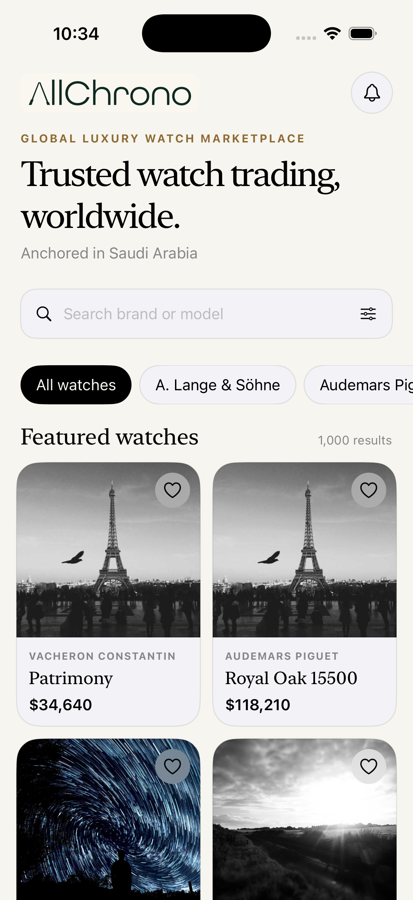

# AllChrono

AllChrono is a global luxury watch marketplace anchored in Saudi Arabia. Its transaction model brings international escrow, authentication, and insured cross-border logistics into a single execution layer.

This native SwiftUI take-home implements the watch-discovery portion of that experience. It renders the provided catalogue of approximately 1,000 watches, supports search and brand filtering, and loads product imagery from the network.

## App preview

<p align="center">
  
</p>

The home screen gives users an immediate overview of the marketplace with catalogue-wide search, brand browsing, pricing, favorites, and a responsive two-column watch grid.

## Requirements

- Xcode 26.4 or later
- iOS 26.4 simulator or device
- An internet connection for product images

No third-party dependencies are required.

For a detailed walkthrough of startup, MVVM-C responsibilities, data flow, navigation, and common extension points, see [`ARCHITECTURE.md`](ARCHITECTURE.md).

## Build and run

1. Clone the repository.
2. Open `AllChrono.xcodeproj` in Xcode.
3. Select the `AllChrono` scheme and an iOS simulator.
4. Press **Run** (`Command-R`).

The watch catalogue is bundled at `AllChrono/Resources/watches.json`, so the listing itself works offline. Product images use the remote URLs in the dataset.

To run the test suite, press **Test** (`Command-U`) or run:

```sh
xcodebuild \
  -project AllChrono.xcodeproj \
  -scheme AllChrono \
  -destination 'platform=iOS Simulator,name=iPhone 17 Pro' \
  test
```

## Architecture

The project uses MVVM-C with protocol-based data boundaries:

- **Model:** `Watch` represents the API contract.
- **View:** SwiftUI catalogue, card, reusable image, filter, and detail views.
- **ViewModel:** `WatchCatalogViewModel` owns loading, search, filtering, favorites, and presentation state.
- **Coordinator:** `AppCoordinator` owns navigation and keeps route decisions out of views.
- **Repository:** `WatchRepository` separates feature logic from data retrieval.
- **Data sources:** `LocalJSONWatchDataSource` powers the take-home, while `RemoteWatchDataSource` and `APIClient` provide the future network path.
- **Dependency composition:** `AppEnvironment` constructs dependencies in one place.

Switching from local JSON to an API only requires changing the data source in `AppEnvironment.live`; the catalogue view and view model remain unchanged.

## Key decisions and trade-offs

- A two-column lazy grid makes a large visual catalogue easy to scan while only creating cells near the viewport.
- Search matches make or model case-insensitively. Brand chips provide a second, direct filtering path.
- The screen includes explicit loading, empty, decoding/file, and image-failure states.
- `AsyncImage` keeps the implementation dependency-free and uses the platform networking stack. A production version would use a dedicated, bounded image cache with request coalescing and prefetching.
- Favorites are intentionally session-only because persistence was outside the requested listing scope.
- A detail route is included to demonstrate coordinator ownership without expanding into a full marketplace flow.
- The provided dataset is decoded into `Decimal` prices and formatted using each item’s currency code rather than assuming USD in the UI.

## What I would improve with more time

- Add disk-backed image caching, cancellation metrics, and image prefetching.
- Add pagination support to the repository/API response model.
- Persist favorites and expose a saved-watches screen.
- Add sort and price-range controls.
- Add snapshot tests, accessibility UI tests, and network-stub integration tests.
- Add analytics and structured logging for loading and image failures.
- Expand localization and Dynamic Type visual testing.

## AI usage

AI assistance was used to help develop the initial UI direction, organize the MVVM-C structure, draft implementation code, and identify build issues. The resulting architecture, behavior, trade-offs, and source were reviewed and validated in Xcode with a successful simulator build.
